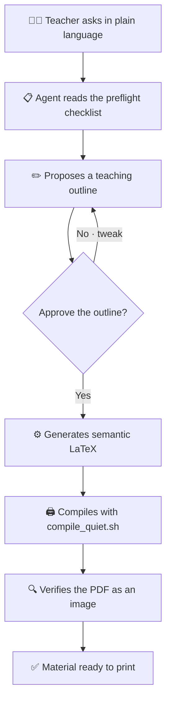
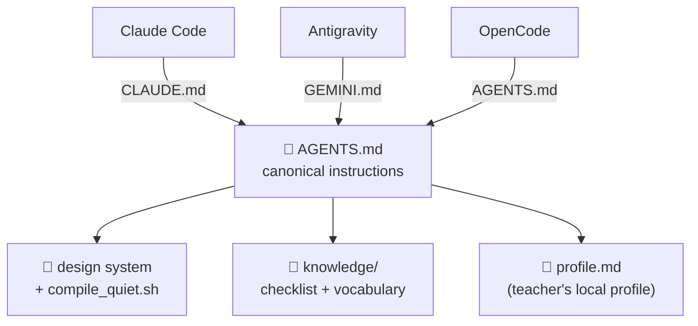

<div align="center">

# 📚 Guías del Profe — Kit

**Turn your terminal AI agent into your typesetter and pedagogical advisor.**
Generate study guides, worksheets, quizzes, exams, slide decks and cheat-sheets
in LaTeX with consistent editorial design — **without knowing LaTeX**.


**🌐 [Español](README.md) · English**

</div>

---

## ✨ What the agent produces

<table>
<tr>
<td width="50%" valign="top">

<br/><sub><b>Study guide</b> — theory, worked examples and tiered practice.</sub>
</td>
<td width="50%" valign="top">

<br/><sub><b>Cut-out worksheet</b> — tables and blanks to fill in by hand.</sub>
</td>
</tr>
<tr>
<td width="50%" valign="top">

<br/><sub><b>Standardized quiz</b> — multiple choice with bubbles + open question.</sub>
</td>
<td width="50%" valign="top">


<br/><sub><b>Beamer 16:9 slides</b> — one idea per slide. For class or YouTube.</sub>
</td>
</tr>
</table>

> Everything comes from the **same design system** (Charter + Inter Display, one
> color per subject). You change the document type, not the look.
>
> *(Sample screenshots are in Spanish — the agent works in any language.)*

---

## 🔧 How it works

The agent never fires off LaTeX blindly: **it proposes, you approve, it generates,
it verifies.**



**Draft first** (no LaTeX without your OK) · **pure semantics** (you write the
*what*; the design lives apart) · **quality pre-flight** (checks a list of common
errors before generating, and verifies the PDF when done).

---

## 🧩 One source, three tools

`AGENTS.md` is the canonical brain; each tool comes in through its own door.



The core (AGENTS.md + scripts + design system + checklist) works in all three.
Claude Code skills/hooks are optional extras.

---

## 🚀 Get started

1. **Requirements:** TeX with `lualatex` + the Charter and Inter fonts. Details in
   [`SETUP.md`](SETUP.md). Check your environment:
   ```bash
   ./check.sh                 # macOS / Linux
   # Windows: powershell -ExecutionPolicy Bypass -File .\check.ps1
   ```
2. Open this folder with your agent (Claude Code / Antigravity / OpenCode); it
   reads `AGENTS.md` automatically.
3. The first time, it offers the onboarding *“who are you and what do you teach?”*
   and saves your local profile (`profile.md`, not versioned).
4. Ask for what you need:
   > *“A worksheet on equivalent fractions for 6th grade, to print in B/W.”*

   It gives you an outline → you approve → it generates and compiles.

📖 **Full guide:** Mac/Windows install in [`SETUP.md`](SETUP.md) · step-by-step
usage and class package in [`USAGE.md`](USAGE.md). *(These docs are currently in
Spanish; the agent itself works in English. English docs welcome via PR.)*

---

## 🧠 It learns as you use it

Every error that comes up is saved in
[`knowledge/preflight-checklist.md`](knowledge/preflight-checklist.md) as
**Rule · Symptom · Cause · Fix**. The agent reads it before generating, so **the
more you use it, the fewer mistakes it makes.** It already ships with dozens of
real LaTeX/lualatex/Beamer gotchas.

---

## 📂 Structure

```
AGENTS.md                  canonical brain (portable)
CLAUDE.md  GEMINI.md        adapters → AGENTS.md
SETUP.md                   Mac/Windows install + requirements
USAGE.md                   step-by-step usage + class package
check.sh · check.ps1       environment check (Mac·Linux · Windows)
compile_quiet.sh · .ps1    compilation (lualatex, 2 passes, clean log)
design/                    design system (preamble.tex, beamer.tex)
knowledge/
  preflight-checklist.md   gotchas (grows over time)
  vocabulario-v5.md        semantic vocabulary of the design system
  imagenes-nanobanana.md   how to generate art with NanoBanana (Gemini)
templates/                 fill-in templates (guia, guia_profe, worksheet, quiz, beamer)
tikzlib/                   reusable TikZ figure library (Punnett, Möller, icons…)
gallery/                   community design gallery (Overleaf-style)
assets/imgs/               document art (placeholders if missing)
commands/setup.md          teacher onboarding
examples/                  examples that compile (guide, worksheet, quiz, slides)
profile.example.md         profile template (the real profile.md is local)
```

> **Class package:** ask for *“the fractions package for 6th grade”* and it
> generates — coherently — the **student guide, the teacher guide, the slides, the
> worksheet and the quiz** under `material/<grade>/<subject>/<topic>/`, with their
> PDFs mirrored in `pdfs/`. Details in [`USAGE.md`](USAGE.md).

---

## 📜 License

[MIT](LICENSE) © 2026 Juan Diego Andrés Prada Ramírez · Instituto Técnico Santo
Tomás, Zapatoca. Use it, modify it and share it freely.

<div align="center"><sub>Made for teachers, by a teacher 👨‍🏫</sub></div>
