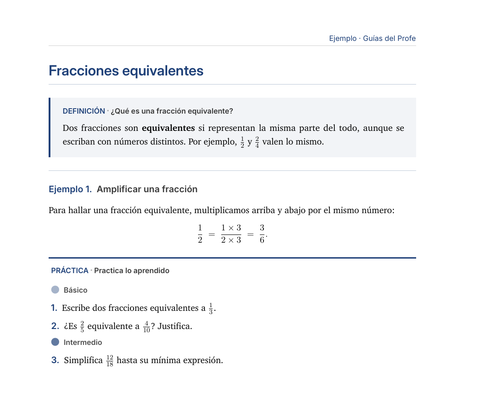
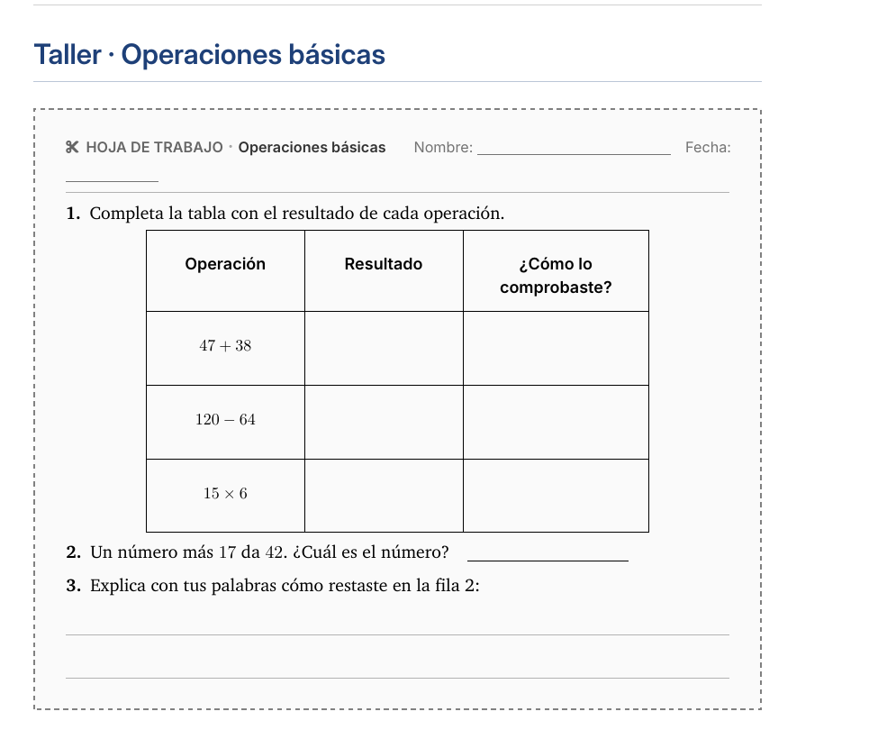
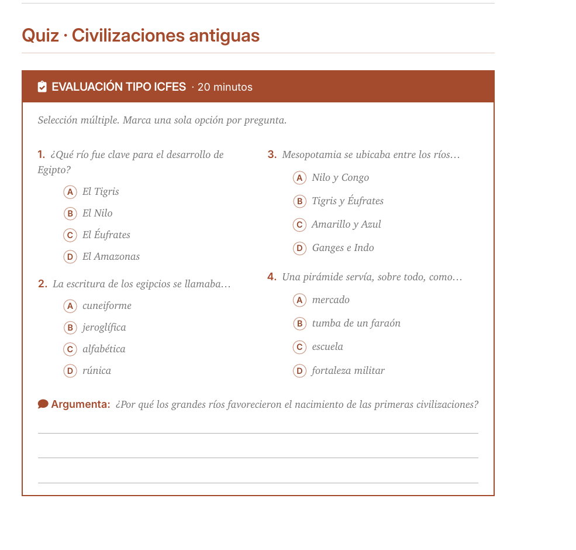
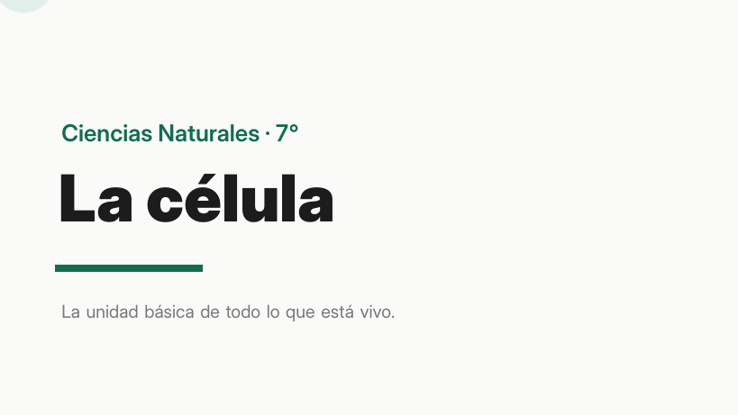
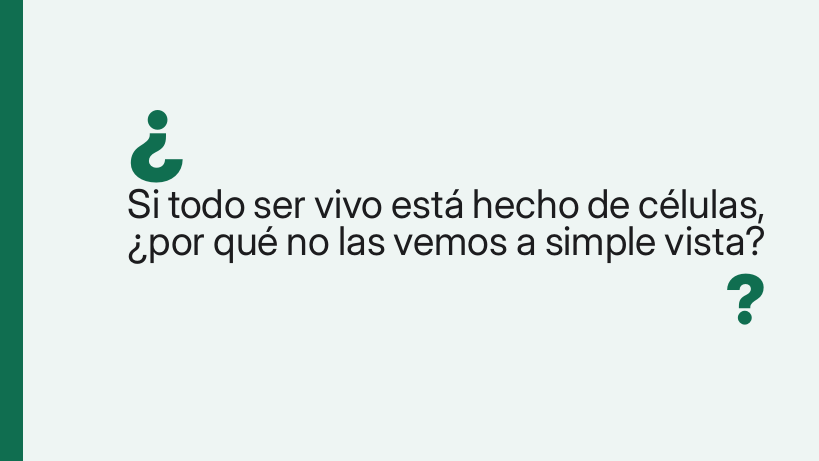
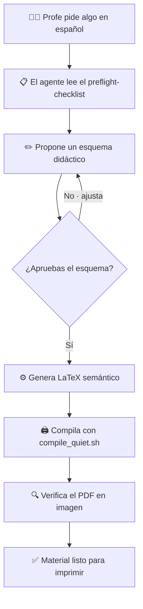
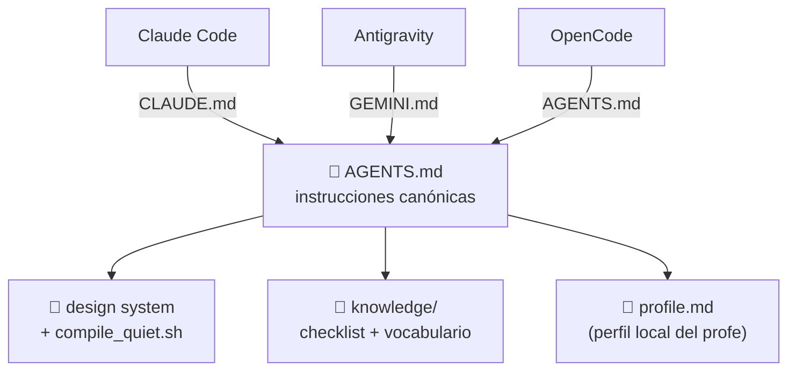

<div align="center">

# 📚 Guías del Profe — Kit

**Convierte tu agente de IA de terminal en tu diagramador y asesor pedagógico.**
Genera guías, talleres, quizzes, exámenes, presentaciones y fichas en LaTeX con
diseño editorial consistente — **sin saber LaTeX**.


**🌐 Español · [English](README.en.md)**

</div>

---

## ✨ Lo que genera el agente

<table>
<tr>
<td width="50%" valign="top">

<br/><sub><b>Guía de aprendizaje</b> — teoría, ejemplos resueltos y práctica por niveles.</sub>
</td>
<td width="50%" valign="top">

<br/><sub><b>Worksheet recortable</b> — hoja con tablas y espacios para llenar a mano.</sub>
</td>
</tr>
<tr>
<td width="50%" valign="top">

<br/><sub><b>Quiz tipo ICFES</b> — selección múltiple con burbujas + pregunta abierta.</sub>
</td>
<td width="50%" valign="top">


<br/><sub><b>Presentación Beamer 16:9</b> — una idea por lámina. Para clase o YouTube.</sub>
</td>
</tr>
</table>

> Todo sale del **mismo design system** (Charter + Inter Display, un color por
> asignatura). Cambias el tipo de documento, no la estética.

---

## 🔧 Cómo funciona

El agente nunca dispara LaTeX a ciegas: **propone, tú apruebas, genera, verifica.**



**Borrador primero** (no escribe LaTeX sin tu visto bueno) · **semántica pura**
(escribes el *qué*; el diseño vive aparte) · **pre-flight de calidad** (consulta
el checklist de errores antes de generar y verifica el PDF al terminar).

---

## 🧩 Una sola fuente, tres herramientas

`AGENTS.md` es el cerebro canónico; cada herramienta entra por su propia puerta.



El núcleo (AGENTS.md + scripts + design system + checklist) funciona en las tres.
Skills/hooks de Claude Code son extras opcionales.

---

## 🚀 Empezar

1. **Requisitos:** TeX con `lualatex` + fuentes Charter e Inter. Detalle en
   [`SETUP.md`](SETUP.md). Verifica tu entorno:
   ```bash
   ./check.sh
   ```
2. Abre esta carpeta con tu agente (Claude Code / Antigravity / OpenCode):
   leerá `AGENTS.md` solo.
3. La primera vez te ofrece el onboarding *«¿quién eres y qué das?»* y guarda tu
   perfil local (`profile.md`, no se versiona).
4. Pídele lo que necesitas:
   > *«Un taller de fracciones equivalentes para 6.º, para imprimir en B/N.»*

   Te da un esquema → lo apruebas → lo genera y compila.

📖 **Guía completa:** instalación Mac/Windows en [`SETUP.md`](SETUP.md) · paso a
paso de uso y paquete de clase en [`USAGE.md`](USAGE.md).

---

## 🧠 Se entrena con el uso

Cada error que aparece se guarda en
[`knowledge/preflight-checklist.md`](knowledge/preflight-checklist.md) con el
formato **Regla · Síntoma · Causa · Fix**. El agente lo lee antes de generar, así
que **entre más lo usas, menos se equivoca.** Ya trae decenas de gotchas reales de
LaTeX/lualatex/Beamer.

---

## 📂 Estructura

```
AGENTS.md                  cerebro canónico (portable)
CLAUDE.md  GEMINI.md        adaptadores → AGENTS.md
SETUP.md                   instalación Mac/Windows + requisitos
USAGE.md                   paso a paso de uso + paquete de clase
WORKFLOW.md                flujo local del autor + cómo entrenar el kit
check.sh · check.ps1       verifica tu entorno (Mac·Linux · Windows)
compile_quiet.sh · .ps1    compilación (lualatex, 2 pasadas, log limpio)
design/                    design system (preamble.tex, beamer.tex)
knowledge/
  preflight-checklist.md   gotchas (se va engordando)
  vocabulario-v5.md        vocabulario semántico del design system
  imagenes-nanobanana.md   cómo generar el arte con NanoBanana (Gemini)
templates/                 plantillas a rellenar (guia, guia_profe, worksheet, quiz, beamer)
assets/imgs/               arte de los documentos (placeholders si falta)
commands/setup.md          onboarding del profe
examples/                  ejemplos que compilan (guía, worksheet, quiz, presentación)
profile.example.md         plantilla del perfil (el real, profile.md, es local)
```

> **Paquete de clase:** pídele *«el paquete de fracciones para 6.º»* y genera
> coherentes la **guía del estudiante, la guía del profe, la presentación, el
> taller y el quiz** en `material/<grado>/<asignatura>/<tema>/`, con sus PDF en
> `pdfs/` espejo. Detalle en [`USAGE.md`](USAGE.md).

---

## 📜 Licencia

[MIT](LICENSE) © 2026 Juan Diego Andrés Prada Ramírez · Instituto Técnico Santo
Tomás, Zapatoca. Úsalo, modifícalo y compártelo libremente.

<div align="center"><sub>Hecho para profes, por un profe 👨‍🏫</sub></div>
