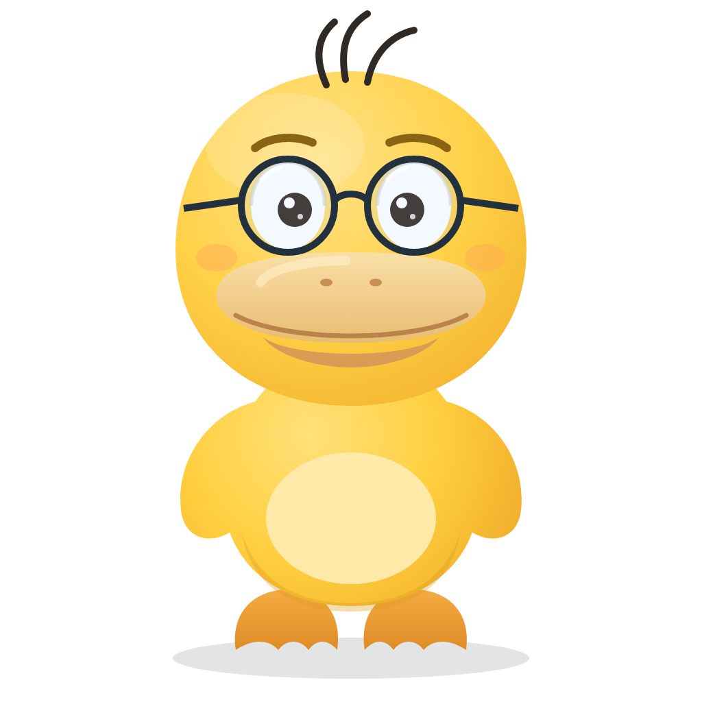

# Dr. Cuack — mascota del kit

Personaje original del kit **Guías del Profe**: un pato amarillo científico-matemático
con gafas redondas, pensado para ilustrar guías, presentaciones y material web.
Es un diseño propio (inspirado en la vibra de las mascotas tipo pato, sin copiar
ningún personaje con derechos), dibujado a mano en SVG con degradados, sombreado
y proporciones editoriales — no figuras geométricas planas.



## Archivos

| Ruta | Qué es |
|---|---|
| `svg/dr-cuack-*.svg` | Personaje por variante. **Autocontenido y animado** (CSS embebido). |
| `png/dr-cuack-*.png` | Export estático 1024×1024, fondo transparente (para LaTeX/impresión). |
| `stickers/svg/` y `stickers/png/` | Stickers tipo meme con borde troquelado y texto (WhatsApp/Telegram/guías). |
| `demo.html` | Galería con las 8 variantes + stickers y botones *hablar / saludar / fondo oscuro*. Abrir en el navegador. |
| `build.py` | Generador: compone base + capas de profesión y regenera `svg/` y `demo.html`. |
| `export_png.py` | Regenera los PNG con Chromium headless (`python3 export_png.py 1024`). |

## Calcado (arte v2 — flujo Nanobanana → SVG)

El arte definitivo del personaje se genera con IA de imagen (p. ej. Nanobanana
en Antigravity) y se **calca a vector** con `calcado/calcar.py`:

```bash
cd assets/personaje/calcado
python3 calcar.py ~/mi-pato.png dr-cuack-base
# → fuente/  svg/ (vector limpio, fondo transparente, animación de respiración)
# → png/ (1024 transparente)
```

El script quita el fondo blanco (flood fill + dilatación anti-halo), detecta la
paleta plana automáticamente, vectoriza con imagetracerjs y elimina el fondo
del SVG. Para que el calco salga bien la imagen fuente debe tener **fondo
blanco sólido, colores planos y contornos definidos** (1024×1024+).

Para variantes de profesión: generar en Nanobanana usando la imagen base como
referencia («same duck character wearing…») y pasar cada PNG por `calcar.py`
— **o** usar `calcado/componer.py`, que superpone accesorios vectoriales en el
mismo estilo plano sobre el calco base y regenera todo:

```bash
cd assets/personaje/calcado
python3 componer.py --png
```

Genera:

- `svg/` y `png/`: las 9 variantes (base, científico, matemático, profesor,
  ingeniero, médico, programador, gánster y **millos**: camiseta azul futbolera
  con estrella, número 10, balón, barba suave y bigote — sin escudo oficial,
  que tiene derechos). Las gafas siempre son **de nerd** (marco grueso) salvo
  el gánster, que lleva gafas oscuras.
- `stickers/`: 12 stickers meme con borde troquelado y texto — los 9 originales
  más **Roll Safe** (tocándose la sien), **Success Kid** (puño en alto) y
  **Stonks** (traje + flecha verde).
- `emoji/`: 15 emojis con la cara del pato — feliz, risa, amor, cool, nerd,
  triste, llorando, enojado, sorprendido, guiño, dormido, fiesta, pensando,
  saludo y **cuentas** (512×512, fondo transparente, listos para
  WhatsApp/Telegram/Slack). Todos parten de un **recorte real de
  `dr-cuack-base.svg`** (`real_head()` en `componer.py`), no de una cara
  redibujada — así la mascota se ve idéntica en el personaje, los stickers y
  los emojis. **El pico nunca se reemplaza**: siempre es el pico real
  calcado, tal cual, en las 15 expresiones. Solo se tapa el ojo (parche
  `TAPA_OJOS`, mismo amarillo) cuando la expresión necesita una mirada
  distinta (llorando, enojado, sorprendido...); si no, se conserva la mirada
  real tal cual (feliz, cool, nerd, pensando...). `explotado` y `cuentas`
  están **animados** (ver abajo).
- `memes/`: formatos de meme famosos recompuestos con Dr. Cuack (dibujo propio,
  no las fotos originales con derechos):
  - **drake-guias** — formato Drake (2 paneles: rechaza / aprueba).
  - **cerebro-galactico** — formato *expanding brain* (4 etapas, cerebro con
    brillo creciente + el pato cada vez con más accesorios).
  - **cambiame-de-opinion** — formato *change my mind* (mesa + cartel).
- `demo.html`: galería con todo.

## Animaciones (SVG, CSS embebido)

Algunas piezas llevan animación embebida (visible solo en SVG, no en el PNG
estático); todas respetan `prefers-reduced-motion`:

- **`emoji-explotado`** — el estallido pulsa (escala + rotación) y las chispas
  vuelan hacia afuera desvaneciéndose, en bucle.
- **`emoji-cuentas`** — referencia a la escena de *Resacón en Las Vegas* donde
  a Alan se le superponen cuentas mientras piensa: operaciones matemáticas
  (`10+9-8+7`, `=13`, `÷2`...) aparecen y se desvanecen flotando frente a la
  cara, cada una con su propio retraso, sobre una mirada cansada de tanto
  calcular.
- **`dr-cuack-cientifico`** (variante) y **`sticker-eureka`** — las burbujas
  del matraz suben y se desvanecen en bucle, escalonadas.
- Todas las variantes/stickers derivados de `dr-cuack-*.svg` heredan además la
  respiración (`bob`) del calco base.

## Variantes y paleta

Los acentos salen del design system del kit (`design/preamble.tex`):

| Variante | Atrezzo | Acento |
|---|---|---|
| `base` | gafas redondas | — |
| `cientifico` | bata, gafas de seguridad, matraz burbujeante | esmeralda `#106E50` |
| `matematico` | chaleco, pajarita, tiza, pizarra con `a²+b²=c²`, símbolos flotantes | azul `#1E4078` |
| `profesor` | birrete con borla, corbata, libro abierto | azul + terracota |
| `ingeniero` | casco, chaleco reflectivo, plano enrollado | ámbar |
| `medico` | bata, estetoscopio, carné con cruz | — |
| `programador` | hoodie con capucha, audífonos, laptop `</>` | índigo `#463782` |
| `ganster` | fedora con banda terracota, traje de rayas, gafas oscuras, palillo | gris `#2B3440` |

## Stickers

9 stickers tipo meme en `stickers/` (`build.py` los genera): *ESTO ESTÁ BIEN*
(con llamas), *CONFÍA EN MÍ, SOY INGENIERO*, *FUNCIONA EN MI MÁQUINA*,
*AQUÍ MANDO YO*, *¿QUÉ MIRAS, BOBO?*, *PRESIONA F*, *MATEMÁGICAS*,
*RECETA: REPASAR* y *¡EUREKA!*. Llevan borde troquelado blanco (filtro
`feMorphology`), sombra suave y texto auto-ajustado. Para añadir uno:
entrada nueva en el dict `ST` de `build.py` (variante + líneas de texto +
extras como llamas/chispas/gota de sudor) y regenerar.

## Animación

Cada SVG trae una animación *idle* automática: respiración (bob), inclinación
sutil de cabeza, parpadeo, mechones al viento y micro-animaciones por variante
(burbujas del matraz, borla del birrete, símbolos flotantes). Respeta
`prefers-reduced-motion`.

Clases opcionales sobre el elemento raíz `<svg>` (requieren SVG inline u
`<object>`, no ``):

- `talk` — abre y cierra el pico (para “hablar”).
- `wave` — saluda con el ala levantada (variantes con `#arm-up`).

Estructura de capas con IDs estables para animar desde fuera (GSAP, CSS, JS):

```
#duck            grupo raíz (bob)
├─ #feet         patas
├─ #wing-left / #wing-right
├─ #body
├─ (ropa por variante: #coat #vest #hoodie …)
├─ #head         (pivote en 256,288)
│  ├─ #hair      mechones
│  ├─ #eye-left / #eye-right  (párpados .lid para parpadeo)
│  ├─ #beak      → #bill-lower (pico inferior, pivote 256,248)
│  └─ #glasses
├─ #arm-up       ala levantada con prop (pivote 330,320)
└─ props: #flask #pizarra #libro #plano #laptop …
```

## Uso

- **Web/HTML:** `` (anima solo) o inline para
  controlar clases.
- **LaTeX:** usar el PNG — `\includegraphics[width=3cm]{assets/personaje/png/dr-cuack-matematico.png}`.
- **Nueva profesión:** en `build.py`, añadir una entrada al dict `V` con las
  capas (`clothing`, `head_gear`, `props`, `front`, `behind`, `css_extra`) y
  correr `python3 build.py`.

## Gotcha de render (verificación en imagen)

Chromium headless **recorta ~70 px inferiores** cuando `--window-size` coincide
exacto con el contenido. `export_png.py` ya lo evita capturando con margen y
recortando; si haces capturas a mano, deja margen vertical extra.
