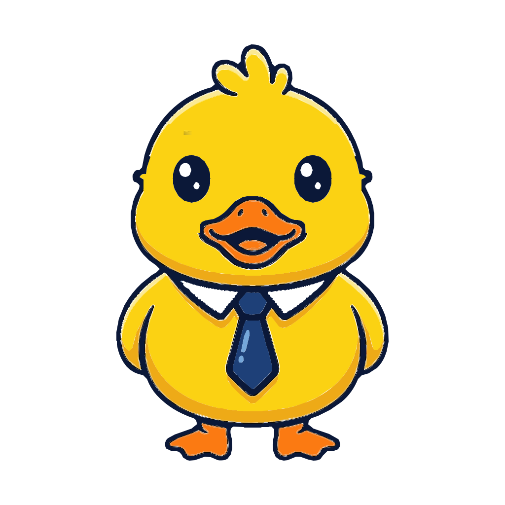

# Dr. Cuack — mascota del kit

Personaje original del kit **Guías del Profe**: un pato amarillo científico-matemático
con gafas de nerd, pensado para ilustrar guías, presentaciones y material web.
Es un diseño propio (inspirado en la vibra de las mascotas tipo pato, sin copiar
ningún personaje con derechos).

**El arte canónico es el "calcado" (v2)**: se genera el PNG con IA de imagen
(Nanobanana/Whisk) y se vectoriza con `calcado/calcar.py` (vtracer + svgo).
El arte vectorial editorial anterior (v1, dibujado a mano con `build.py`) quedó
archivado en [`_v1-editorial/`](_v1-editorial/) por si se quiere ese estilo con
degradados.



## Archivos

| Ruta | Qué es |
|---|---|
| **`PROMPTS-nanobanana.md`** | **Prompts listos para Whisk/Nanobanana**: base, roles y expresiones, con la técnica de consistencia (imagen base como *Subject*). |
| `calcado/svg/dr-cuack-*.svg` | Personaje por variante. Autocontenido y **animado** (respiración CSS). |
| `calcado/png/dr-cuack-*.png` | Export estático 1024×1024, fondo transparente (para LaTeX/impresión). |
| `calcado/stickers/` | 12 stickers meme con borde troquelado y texto. |
| `calcado/emoji/` | 15 emojis de la cara (512×512, WhatsApp/Telegram/Slack); `explotado` y `cuentas` animados. |
| `calcado/memes/` | Formatos de meme famosos recompuestos (Drake, expanding brain, change my mind). |
| `calcado/demo.html` | Galería con todo. Abrir en el navegador. |
| `calcado/calcar.py` | **Pipeline PNG→SVG**: quita fondo, vectoriza con vtracer, anima y optimiza con svgo. |
| `calcado/componer.py` | Genera variantes/stickers/emojis/memes componiendo sobre el calco base. |
| `export_png.py` | Regenera los PNG con Chromium headless (`python3 export_png.py 1024`). |
| `svgo.config.mjs` | Config svgo **segura para animación** (conserva IDs, `@keyframes` y `prefers-reduced-motion`). |
| `_v1-editorial/` | Arte v1 archivado (build.py, degradados). No se mantiene. |

## Flujo: de la idea al SVG del kit

```bash
# 1. Generar el PNG en Whisk/Nanobanana con los prompts de PROMPTS-nanobanana.md
#    (fondo blanco sólido, colores planos, contorno definido, 1024×1024+).

# 2. Vectorizar:
cd assets/personaje/calcado
python3 calcar.py ~/Descargas/mi-pato.png dr-cuack-base
# → fuente/ (copia del PNG)  svg/ (vector limpio, transparente, animado)  png/ (1024)

# 3. (Opcional) Regenerar variantes, stickers, emojis y memes compuestos:
python3 componer.py --png
```

`calcar.py` hace: flood fill del fondo blanco desde los bordes (+ dilatación
anti-halo, centinela magenta) → **vtracer** (`@neplex/vectorizer`, curvas
spline, `filterSpeckle` elimina motas) → borra el fondo del SVG → envuelve con
la animación de respiración → **svgo** con la config segura (~−50 % de peso).
Las dependencias npm se instalan solas la primera vez.

## Optimización (svgo)

Todos los SVG del personaje pasan por svgo con `svgo.config.mjs`. **Nunca usar
svgo con la config por defecto**: borra `id="duck"`, los `@keyframes` no usados
en atributos y el bloque `prefers-reduced-motion`, rompiendo la animación. Para
re-optimizar a mano:

```bash
npx svgo --config assets/personaje/svgo.config.mjs -rf assets/personaje
```

## Animaciones (SVG, CSS embebido)

Visibles solo en SVG (no en el PNG estático); todas respetan
`prefers-reduced-motion`:

- Todos los `dr-cuack-*.svg` calcados: **respiración** (`bob`) del grupo `#duck`.
- **`emoji-explotado`** — el estallido pulsa y las chispas vuelan desvaneciéndose.
- **`emoji-cuentas`** — operaciones matemáticas flotan y se desvanecen frente a
  la cara (guiño a la escena de las cuentas de *Resacón en Las Vegas*).
- **`dr-cuack-cientifico`** y **`sticker-eureka`** — burbujas del matraz suben
  en bucle, escalonadas.

## Variantes y paleta

Los acentos salen del design system del kit (`design/preamble.tex`):

| Variante | Atrezzo | Acento |
|---|---|---|
| `base` | corbata azul | — |
| `cientifico` | bata, gafas de seguridad, matraz | esmeralda `#106E50` |
| `matematico` | chaleco, pajarita, tiza, pizarra `a²+b²=c²` | azul `#1E4078` |
| `profesor` | birrete con borla, corbata, libro | azul + terracota |
| `ingeniero` | casco, chaleco reflectivo, plano | ámbar |
| `medico` | bata, estetoscopio, carné con cruz | — |
| `programador` | hoodie, audífonos, laptop `</>` | índigo `#463782` |
| `ganster` | fedora, traje de rayas, gafas oscuras | gris `#2B3440` |
| `millos` | camiseta azul futbolera con estrella y 10, balón, barba y bigote (sin escudo oficial) | azul |

Las gafas siempre son **de nerd** (marco grueso), salvo el gánster (oscuras).
Los emojis parten de un **recorte real** del calco base (`real_head()` en
`componer.py`) y **el pico nunca se reemplaza** — así la mascota es idéntica en
personaje, stickers y emojis.

## Uso

- **Web/HTML:** `` (anima solo) o
  inline para controlarlo con CSS/JS.
- **LaTeX:** usar el PNG —
  `\includegraphics[width=3cm]{assets/personaje/calcado/png/dr-cuack-matematico.png}`.
- **Rol nuevo:** generar el PNG con el prompt de rol (ver
  `PROMPTS-nanobanana.md`) y pasarlo por `calcar.py`, **o** añadir la capa
  vectorial en `componer.py` y regenerar.

## Gotcha de render (verificación en imagen)

Chromium headless **recorta ~70 px inferiores** cuando `--window-size` coincide
exacto con el contenido. `export_png.py` ya lo evita capturando con margen y
recortando; si haces capturas a mano, deja margen vertical extra. Si Chromium
no está disponible, `rsvg-convert -w 1024 in.svg -o out.png` sirve para
verificar.
