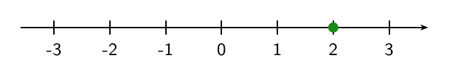
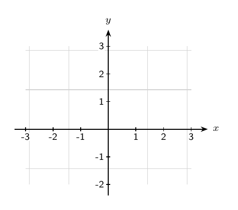
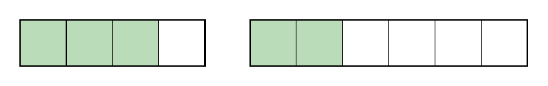
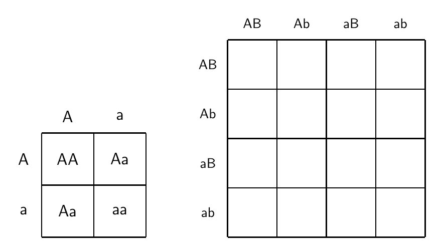
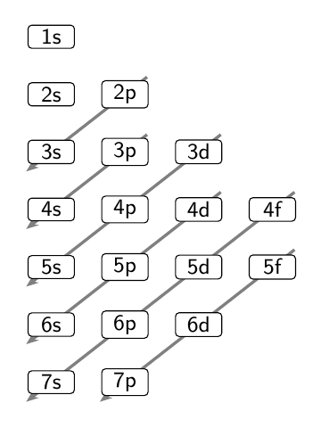
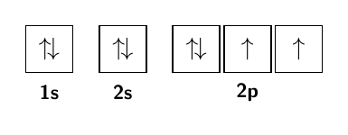
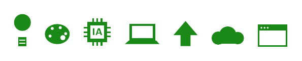

# tikzlib — librería de figuras TikZ reutilizables

Figuras ya hechas y probadas, para **no regenerarlas cada vez**. El agente
revisa aquí antes de dibujar; si la figura existe, la reúsa.

## Cómo se usan

Dos formas (el agente elige según el caso):

- **Referencia (`\input`)** — el documento vive en el kit:
  ```latex
  \input{tikzlib/ciencias/punnett.tex}      % en el preámbulo o antes de usar
  ...
  \punnettdos{A}{a}{A}{a}{}{}{}{}            % en el cuerpo
  ```
- **Copiar el snippet** — para un `.tex` suelto que enviarás (sin depender del
  kit): pega el contenido del archivo en tu documento.

> **Requisitos:** cada figura indica en su cabecera qué paquetes/librerías
> necesita (casi todas: `\usepackage{tikz}`; Möller añade
> `\usetikzlibrary{calc, arrows.meta}`).

---

## Catálogo

### 📐 Matemáticas

**`matematicas/recta-numerica.tex`** — recta numérica con marcas enteras.
`\rectanumerica{-3}{3}` · `\rectapunto{-3}{3}{2}` (con punto marcado).



**`matematicas/plano-cartesiano.tex`** — plano con rejilla, ejes y números.
`\planocartesiano{xmin}{xmax}{ymin}{ymax}`. Requiere `arrows.meta`.



**`matematicas/fracciones.tex`** — barras de fracción. `\fraccionbarra{n}{k}`
(n partes, k sombreadas).



### 🔬 Ciencias

**`ciencias/punnett.tex`** — cuadros de Punnett 2×2 y 4×4 (genética).
`\punnettdos{tp1}{tp2}{tm1}{tm2}{c11}{c12}{c21}{c22}` (celdas vacías = `{}`) ·
`\punnettcuatro{...}{...}` (4×4 vacío).



**`ciencias/moeller.tex`** — diagrama de Möller (regla de las diagonales).
`\moeller` (sin argumentos). Requiere `calc` y `arrows.meta`.



**`ciencias/orbitales.tex`** — diagramas de orbitales (cajas + flechas de espín).
`\sub{2p}{3}` (vacío) · `\subll{2p}{\fludn,\flup,\flup}` (lleno) · flechas
`\flup \fldn \fludn`.



### 🎨 Iconos

**`iconos/web.tex`** — iconos planos: `\iconbombilla \iconpalette \iconchip
\iconlaptop \icondeploy \iconcloud \iconbrowser`. Color opcional:
`\iconcloud[blue]` (por defecto `accent`).



---

## Agregar una figura nueva

1. Crea `tikzlib/<categoría>/<nombre>.tex` con **solo las macros** (sin
   `\documentclass`), y una cabecera que diga: qué es, requisitos y uso.
2. Genera su preview en `tikzlib/previews/<nombre>.png` (un `standalone` que la
   dibuje; ver los `_src` de ejemplo en el historial).
3. Añádela a este catálogo.
4. `git add tikzlib/ && git commit && git push`.

> Categorías sugeridas: `matematicas/`, `ciencias/`, `sociales/`, `iconos/`.
> Ideas para sumar: recta numérica, plano cartesiano, barras de fracción,
> célula, línea de tiempo, mapa conceptual.
