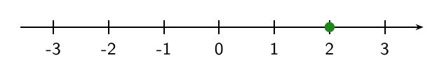
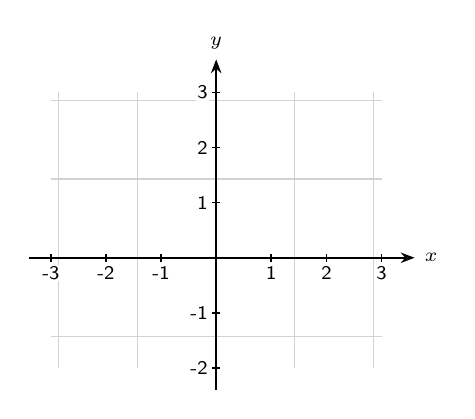
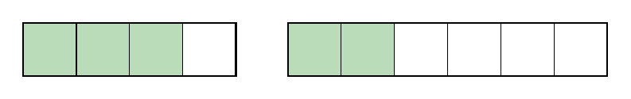
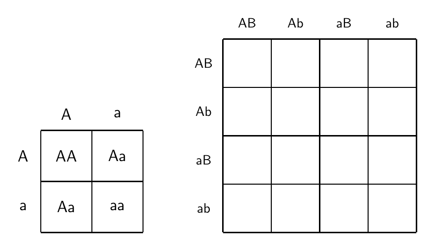
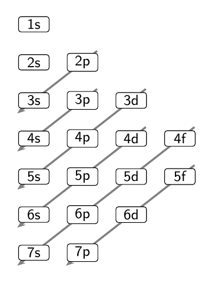
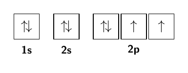
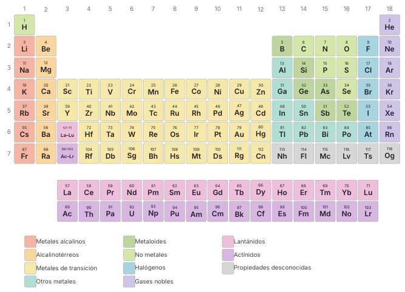
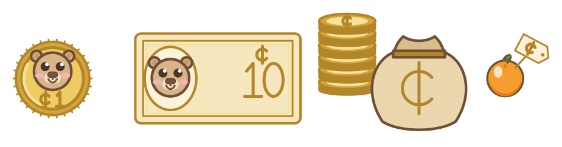
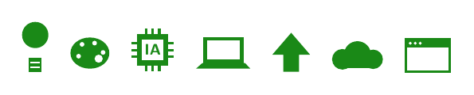

# tikzlib — librería de figuras TikZ reutilizables

Figuras ya hechas y probadas, para **no regenerarlas cada vez**. El agente
revisa aquí antes de dibujar; si la figura existe, la reúsa.

## Cómo se usan

Dos formas (el agente elige según el caso):

- **Referencia (`\input`)** — el documento vive en el kit:
  ```latex
  \input{tikzlib/ciencias/punnett.tex}      % en el preámbulo o antes de usar
  ...
  \punnettdos{A}{a}{A}{a}{}{}{}{}            % en el cuerpo
  ```
- **Copiar el snippet** — para un `.tex` suelto que enviarás (sin depender del
  kit): pega el contenido del archivo en tu documento.

> **Requisitos:** cada figura indica en su cabecera qué paquetes/librerías
> necesita (casi todas: `\usepackage{tikz}`; Möller añade
> `\usetikzlibrary{calc, arrows.meta}`).

---

## Catálogo

### 📐 Matemáticas

**`matematicas/recta-numerica.tex`** — recta numérica con marcas enteras.
`\rectanumerica{-3}{3}` · `\rectapunto{-3}{3}{2}` (con punto marcado).



**`matematicas/plano-cartesiano.tex`** — plano con rejilla, ejes y números.
`\planocartesiano{xmin}{xmax}{ymin}{ymax}`. Requiere `arrows.meta`.



**`matematicas/fracciones.tex`** — barras de fracción. `\fraccionbarra{n}{k}`
(n partes, k sombreadas).



### 🔬 Ciencias

**`ciencias/punnett.tex`** — cuadros de Punnett 2×2 y 4×4 (genética).
`\punnettdos{tp1}{tp2}{tm1}{tm2}{c11}{c12}{c21}{c22}` (celdas vacías = `{}`) ·
`\punnettcuatro{...}{...}` (4×4 vacío).



**`ciencias/moeller.tex`** — diagrama de Möller (regla de las diagonales).
`\moeller` (sin argumentos). Requiere `calc` y `arrows.meta`.



**`ciencias/orbitales.tex`** — diagramas de orbitales (cajas + flechas de espín).
`\sub{2p}{3}` (vacío) · `\subll{2p}{\fludn,\flup,\flup}` (lleno) · flechas
`\flup \fldn \fludn`.



**`ciencias/tabla_periodica.tex`** — tabla periódica completa (118 elementos),
coloreada por familia + leyenda. Parametrizable y con figuras de tendencias.
Requiere `calc, arrows.meta, etoolbox`.
- `\tablaperiodica` — tabla completa a color con leyenda.
- `\tablaperiodica[resaltar={Na,Cl},atenuar]` — resalta esos elementos (borde
  grueso) y atenúa el resto. `leyenda=false` la oculta.
- `\tablaperiodicacontenido` — solo las celdas (dentro de tu propia
  `tikzpicture`), para superponer flechas. Cada celda es un nodo `pt-<Símbolo>`
  (p. ej. `pt-Na`); rejilla en coords `(columna, -periodo)`.
- `\pttendencia{radio|ei|en}` — figura de tendencia (tabla atenuada + flechas):
  radio atómico, energía de ionización, electronegatividad.
- **SVG para Manim** (`SVGMobject`, fuentes trazadas a paths):
  `assets/svg-src/tabla-periodica/{tabla_periodica,tendencia_radio,tendencia_ei,tendencia_en}.svg`.
  PDFs vectoriales para guías/Beamer en `assets/imgs/tabla-periodica/`.



**`ciencias/termodinamica.tex`** — figuras de **Termodinámica** (Física 8°), listas
para guías (`design/preamble.tex`) y Beamer (`design/beamer.tex`). Requiere
`calc, arrows.meta, positioning` (ya presentes en ambos preambles). Define
localmente `calido` (rojo), `frio` (azul), `tibio`, `humo`; usa `subjectcolor` como
acento. Todas las macros son **sin argumentos**:
- `\termometros` — tres escalas °C · K · °F comparadas (termómetros dibujados).
- `\transfcalor` — conducción · convección · radiación (3 paneles con leyenda).
- `\teoriacinetica` — caja de partículas: la presión = suma de choques.
- `\graficaboyle` — curva P–V (hipérbola, T constante).
- `\graficacharles` — recta V–T que apunta al cero absoluto (P constante).
- `\graficagaylussac` — recta P–T (V constante).
- `\motorcuatrotiempos` — ciclo Otto: admisión·compresión·explosión·escape.
- `\maquinatermica` — foco caliente → máquina (produce W) → foco frío.
- `\lineatiempotermo` — línea de tiempo de la termodinámica (1593–1876).
- `\mapatermo` — mapa conceptual de las tres unidades.

Las que son anchas (`\lineatiempotermo`, `\mapatermo`, `\motorcuatrotiempos`) se
escalan con `\resizebox{\linewidth}{!}{...}`. Usadas en
`material/8/fisica-termo/{guia,guia_eje2,guia_eje3,beamer,beamer_eje2,beamer_eje3}.tex`.

### 🧸 Personajes

**`interes/capibara_kawaii.tex`** — capibara **kawaii / chibi ORIGINAL** (obra
propia, CC0) para la serie de matemática financiera (interés simple/compuesto).
Cuerpo ovalado marrón claro, ojos redondos grandes con brillo, nariz grande,
rubor y sonrisa. `\capibarakawaii` · `[hold]` (bracitos arriba para sostener la
naranja) · `[wink]` (guiño, para parpadeo) · `[blush=false]`. Recoloreable con
`\colorlet{capicuerpo}{...}`. **SVG apto `SVGMobject`** (18 submobjects, paths,
sin texto/gradientes) en `assets/svg-src/interes/capibara_kawaii.svg`.


**`interes/capidolar.tex`** — **CAPIDÓLARES**, la moneda propia de la serie (obra
propia, CC0). El **dinero que crece con el interés** (las naranjas pasan a ser los
**bienes** que se compran). Dorado/mostaza, plano, a juego con el capibara; reusa
su carita vía `\capicara`. Símbolo propio **`Ȼ`** y números dibujados como **trazos
TikZ (paths, nunca `<text>`)** → **SVG apto `SVGMobject`**. Macros:
`\capidolarmoneda` (moneda `Ȼ1`), `\capidolarbillete` (`Ȼ10`), `\capidolarpila`
(torre de monedas, crecimiento 1→muchas), `\capidolarsaco` (montos grandes),
`\naranjaprecio` (bien con cartelito de precio, para inflación); bloque
`\capipuck{cx}{cy}` arma pilas a gusto. Recoloreable con `\colorlet{oro}{...}`.
SVG en `assets/svg-src/interes/capidolar_*.svg` + `naranja_precio.svg`.



### 🎨 Iconos

**`iconos/web.tex`** — iconos planos: `\iconbombilla \iconpalette \iconchip
\iconlaptop \icondeploy \iconcloud \iconbrowser`. Color opcional:
`\iconcloud[blue]` (por defecto `accent`).



---

## Agregar una figura nueva

1. Crea `tikzlib/<categoría>/<nombre>.tex` con **solo las macros** (sin
   `\documentclass`), y una cabecera que diga: qué es, requisitos y uso.
2. Genera su preview en `tikzlib/previews/<nombre>.png` (un `standalone` que la
   dibuje; ver los `_src` de ejemplo en el historial).
3. Añádela a este catálogo.
4. `git add tikzlib/ && git commit && git push`.

> Categorías sugeridas: `matematicas/`, `ciencias/`, `sociales/`, `iconos/`.
> Ideas para sumar: recta numérica, plano cartesiano, barras de fracción,
> célula, línea de tiempo, mapa conceptual.
